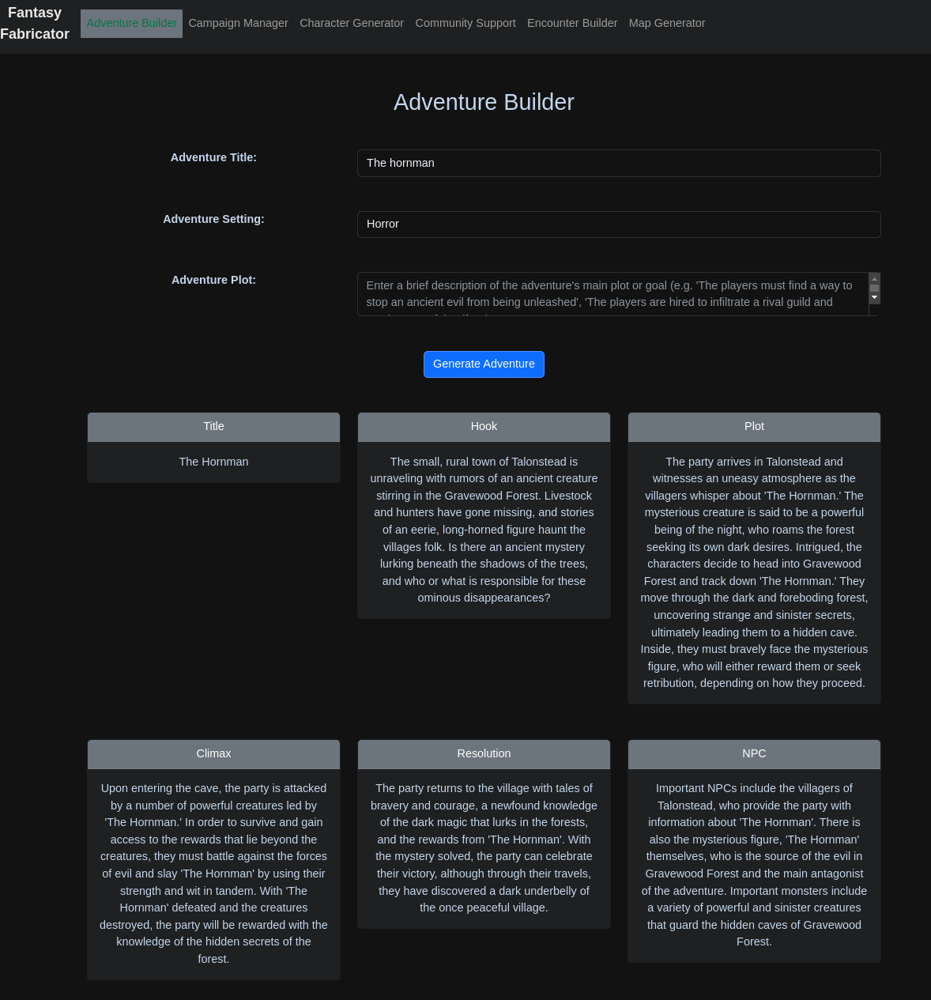

# Fantasy Fabricator
A tool to help you create and manage your adventures, characters, and enemies with the help of GPT-3.



## Features
- Adventure Builder: Generate unique and exciting adventure ideas.

## Planned Features
- NPC Generator: Generate detailed and compelling characters.
- Enemy Generator: Generate terrifying and challenging enemies.
- Campaign Manager: Keep track of your campaigns and adventures.
- Map Generator: Create detailed and immersive maps.
## Getting Started
These instructions will get you a copy of the project up and running on your local machine for development and testing purposes.

### Prerequisites
- Node.js
- npm
- Python 3.1x

### Installing
1. Clone the repository
```sh
git clone https://github.com/laudanum123/fantasy_fabricator.git
```
2. Install the dependencies
```sh
cd frontend/ 
npm install
```
```sh
pip install -r requirements.txt
```
3. Create API-File with your OpenAI API-Key
```sh
touch ./backend/api_key.py
```
```python
#./backend/api_key.py
API_KEY = 'YOUR-OPENAI-API-KEY'
# Make sure to add this file to .gitignore if you plan on contributing
```

4. Start the development server
```sh
cd frontend/ 
npm run serve
```
```sh
python backend/app.py
```
5. Install the spacy named entity package
```sh
python -m spacy download en_core_web_sm
```

6. Open http://localhost:8080 in your browser to see the application.

## Built With
- Vue.js - The Progressive JavaScript Framework
- Bootstrap - CSS Framework
- Flask

## Contributing
Please fork the repo and create a pull request if you want to contribute

Authors
Laudanum - Initial work - laudanum123

